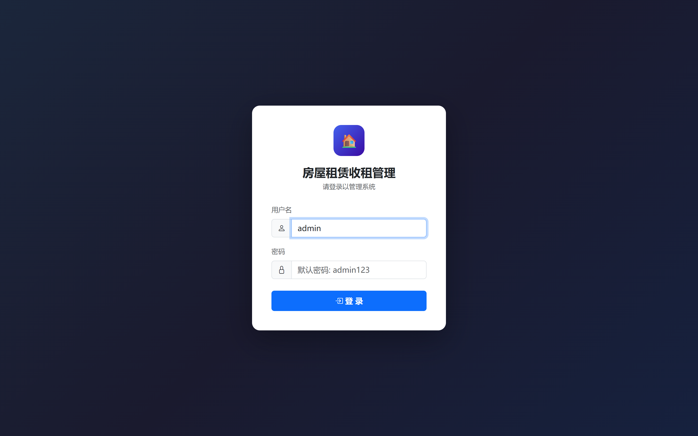
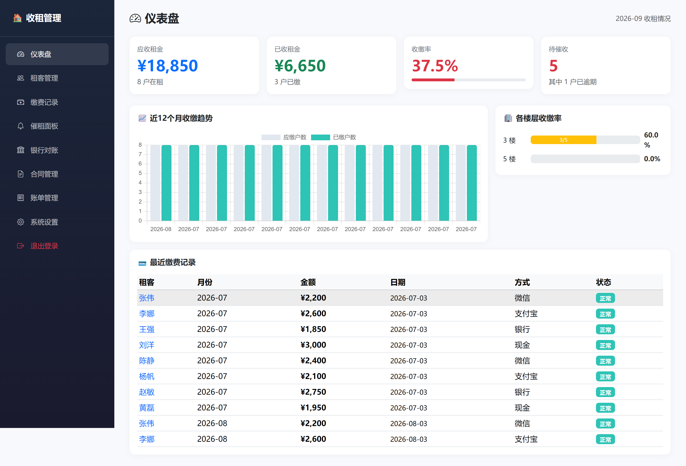
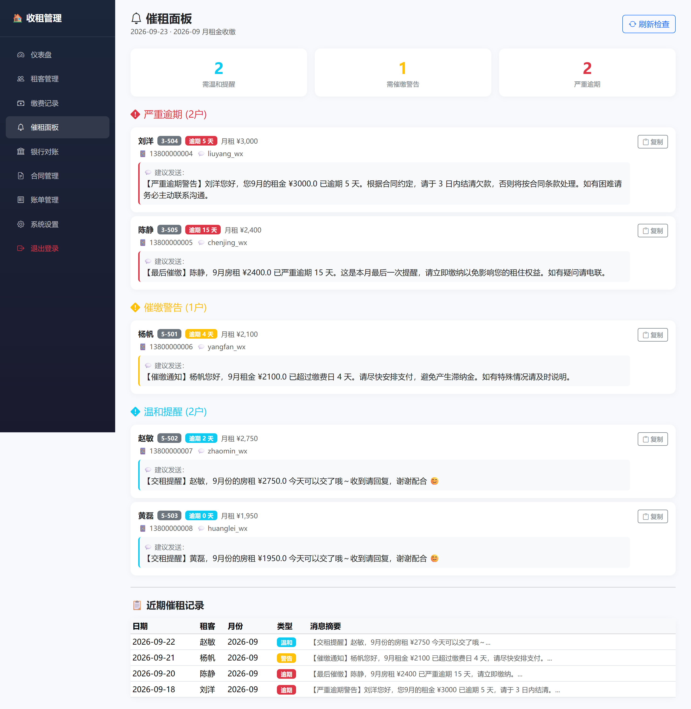
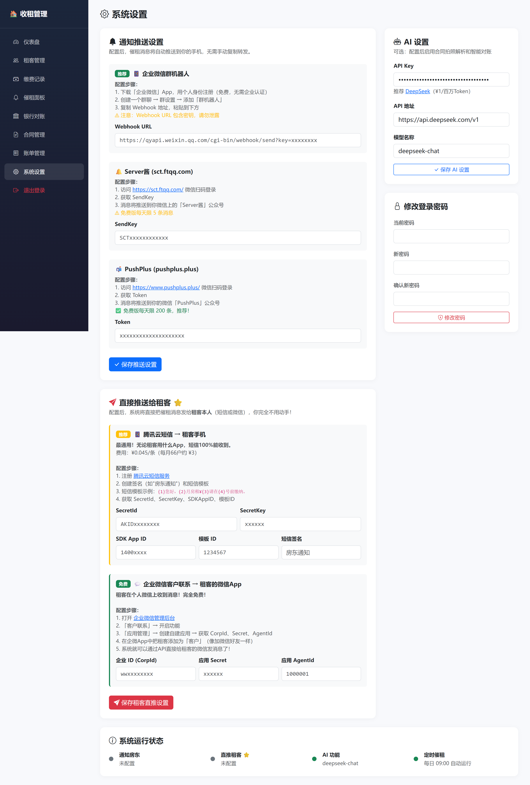
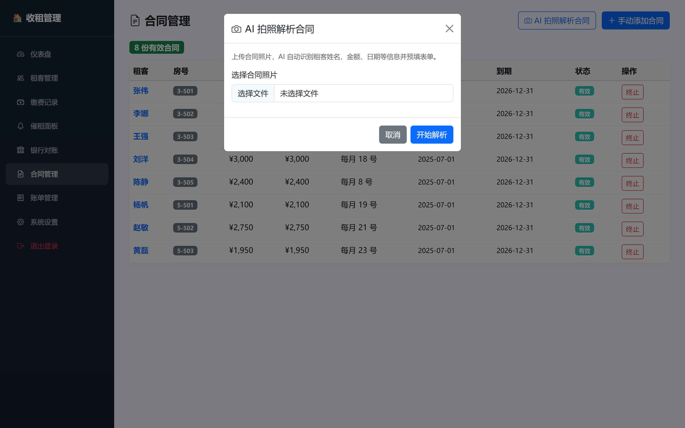
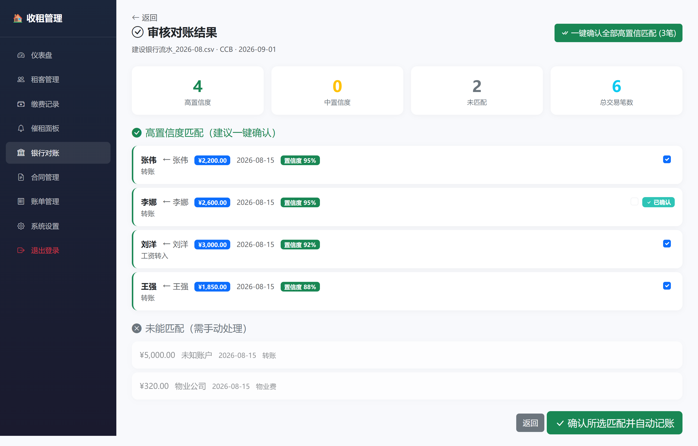
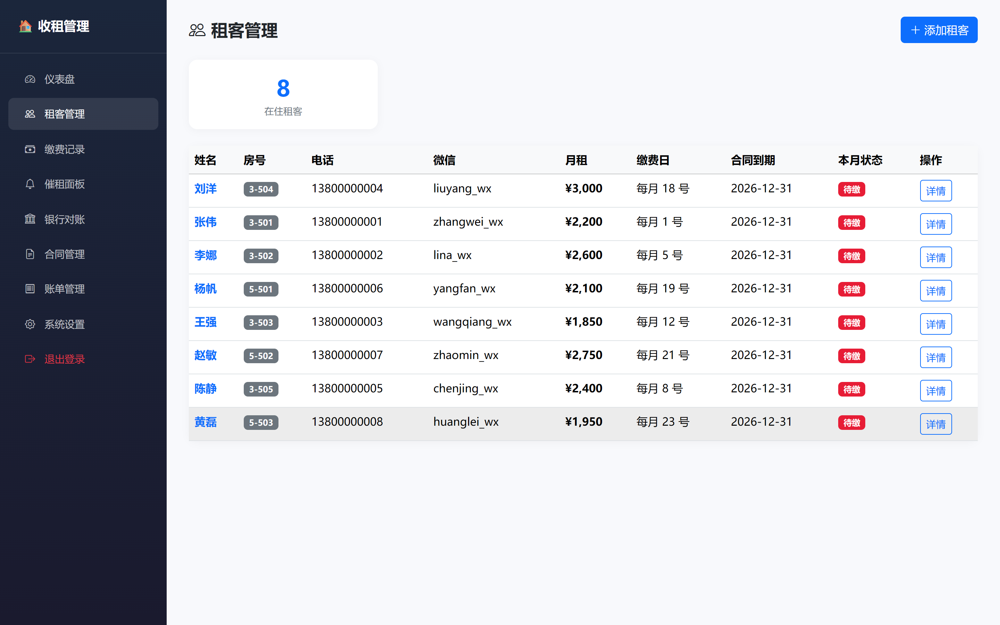
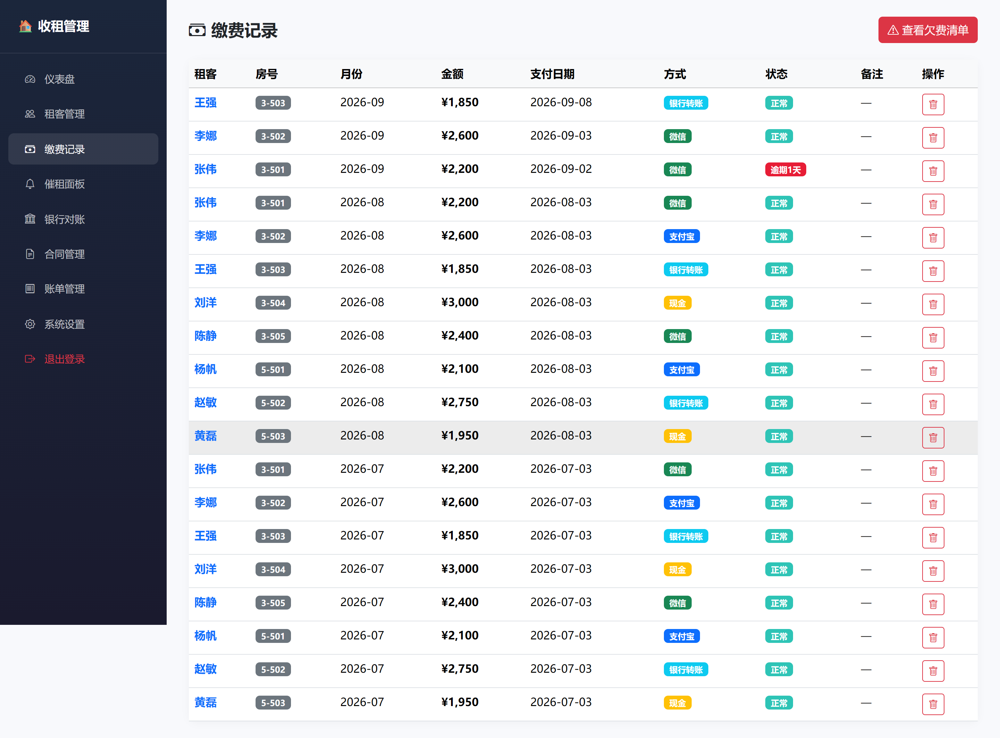
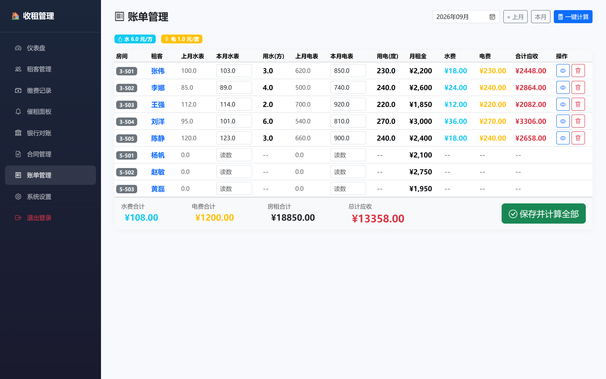

# 🏠 房屋租赁收租管理系统

面向房东 / 二房东的一站式收租管理工具，覆盖 **租客 → 合同 → 收款 → 欠费 → 催租 → 水电账单** 全流程，并内置 **AI 合同解析** 与 **银行流水智能对账** 能力。


---

## ✨ 功能特性

| 模块 | 说明 |
|---|---|
| 📊 仪表盘 | 收缴率、应收/已收/欠费统计、各楼层收缴情况、近 12 个月趋势 |
| 👥 租客管理 | 房间 / 租客 / 合同的关联管理，自动识别当前在住租客 |
| 💰 缴费记录 | 收款登记、欠费（arrears）追踪、逾期天数计算 |
| 🏦 银行对账 | 导入建行/工行流水（CSV/Excel，自动识别 GBK 编码与列名），三遍法智能匹配「谁交了房租」，一键确认生成缴费记录 |
| 📄 合同管理 | 上传合同照片，**视觉大模型**自动提取结构化字段 |
| 🔔 催租提醒 | APScheduler 每日 9:00 自动催租，温和 / 警告 / 逾期三档 |
| 📢 通知推送 | 房东：企业微信机器人 / Server酱 / PushPlus；租客：腾讯云短信 / 企业微信应用 |
| 🧾 水电账单 | 批量录入水表电表读数、自动结转上月、自动算费、生成分享文案 |
| ⚙️ 系统设置 | 通知渠道开关与配置 |

## 🤖 AI 能力

系统通过 **DeepSeek**（OpenAI SDK 兼容接口）接入两项 AI 能力：

1. **合同照片解析** —— 上传租赁合同照片，视觉模型提取 `租客姓名 / 手机号 / 房间号 / 月租金 / 押金 / 缴费日 / 起止日期 / 身份证号` 等结构化字段，自动入库。
2. **银行流水智能对账** —— 采用「规则匹配 + LLM 兜底」三级策略：先按精确金额 + 姓名匹配，再模糊金额匹配，最后对低置信度交易调用 LLM 判断归属，显著提升非标准流水的匹配准确率。

> **模型说明**：文本推理使用 `deepseek-chat`；合同照片解析使用多模态视觉模型 `deepseek-flash`（旧名 `deepseek-v4-flash-vision-exp`）。`deepseek-chat` 为纯文本模型、**不支持图片输入**，故视觉任务必须走 `deepseek-flash`。
>
> 未配置 `LLM_API_KEY` 时自动降级为纯规则模式，不影响核心流程。

## ⏰ 定时催租 + 消息推送

系统内置 **APScheduler 定时任务**，每日 09:00 自动扫描欠费租客并按三档策略催租：

| 档位 | 触发条件 | 话术示例 |
|---|---|---|
| 温和提醒（gentle） | 缴费日当天 | 「本月房租可以交啦～」 |
| 警告催缴（warning） | 逾期 ≥ 3 天 | 「已超过缴费日 N 天，请尽快安排支付」 |
| 逾期警告（overdue） | 逾期 ≥ 5 天 | 「已严重逾期，请于 3 日内结清」 |

推送渠道分两类，支持一键直推 / 逐户推送，并完整记录催租历史（时间、渠道、话术、响应状态）：

- **通知房东**：企业微信群机器人 / Server酱 / PushPlus —— 汇总每日欠费清单
- **通知租客**：腾讯云短信 / 企业微信应用 —— 直接触达租客本人

## 🖼 界面截图

**登录页**



**仪表盘**



**催租面板（定时任务推送）**



**系统设置（通知渠道 + AI）**



**合同管理（AI 拍照解析）**



**银行对账（AI 匹配）**



**租客管理**



**缴费记录**



**水电账单**



> 截图使用 `scripts/seed_demo.py` 生成的演示数据，不含真实信息。

## 🛠 技术栈

- **后端**：Python 3.11 · FastAPI · SQLAlchemy 2.0 · SQLite（WAL 模式）· Jinja2 · APScheduler
- **数据处理**：pandas · openpyxl（银行流水解析）
- **AI**：OpenAI SDK → DeepSeek（`deepseek-chat`）
- **认证**：Passlib + bcrypt
- **前端**：Bootstrap 5 · Chart.js · htmx · Bootstrap Icons

## 📁 目录结构

```
房屋租赁管理/
├── app/
│   ├── main.py              # 应用入口 + 每日催租定时任务
│   ├── config.py            # 配置（读取 .env）
│   ├── database.py          # SQLAlchemy 引擎 / 会话
│   ├── models/              # 数据模型（房间/租客/合同/缴费/流水/账单…）
│   ├── routers/             # 路由（认证/仪表盘/租客/缴费/对账/合同/提醒/账单/设置）
│   ├── services/            # 业务逻辑（对账匹配/合同解析/通知/催租/报表）
│   ├── templates/           # Jinja2 服务端模板
│   └── static/              # 静态资源
├── scripts/
│   └── seed_demo.py         # 一键生成演示数据
├── data/                    # SQLite 数据库（已加入 .gitignore）
├── requirements.txt
├── run.py                   # 启动入口
└── .env.example             # 环境变量模板
```

## 🚀 快速开始

```bash
# 1. 安装依赖（Python 3.11）
pip install -r requirements.txt

# 2. 配置环境变量
cp .env.example .env
# 编辑 .env：至少设置 ADMIN_PASSWORD（登录密码）
# 可选：填入 LLM_API_KEY 启用 AI 功能

# 3. 启动
python run.py
# 或：python -m uvicorn app.main:app --host 127.0.0.1 --port 8000

# 4. 访问 http://127.0.0.1:8000 ，账号 admin，密码为 .env 中的 ADMIN_PASSWORD
```

### 生成演示数据

```bash
python scripts/seed_demo.py          # 写入独立的 data/demo.db（不影响真实数据）

# Windows CMD
set DATABASE_URL=sqlite:///./data/demo.db
python run.py                        # 登录 admin / admin123

# macOS / Linux
DATABASE_URL=sqlite:///./data/demo.db python run.py
```

## 🔧 配置说明

| 环境变量 | 说明 | 必填 |
|---|---|---|
| `SECRET_KEY` | 会话密钥 | 建议 |
| `ADMIN_PASSWORD` | 登录密码（默认 `admin123`） | 建议 |
| `DATABASE_URL` | 数据库地址（默认 SQLite） | 否 |
| `LLM_API_KEY` | DeepSeek API Key，配置后启用 AI | 否 |
| `LLM_API_BASE` / `LLM_MODEL` / `LLM_VISION_MODEL` | AI 接口地址与模型 | 否 |
| `WECOM_WEBHOOK_URL` | 企业微信群机器人（通知房东） | 否 |
| `SERVERCHAN_SEND_KEY` | Server酱（通知房东） | 否 |
| `PUSHPLUS_TOKEN` | PushPlus（通知房东） | 否 |
| `SMS_SECRET_ID` 等 | 腾讯云短信（通知租客） | 否 |
| `WECOM_CORP_ID` 等 | 企业微信应用（通知租客） | 否 |

## 📄 License

MIT License
